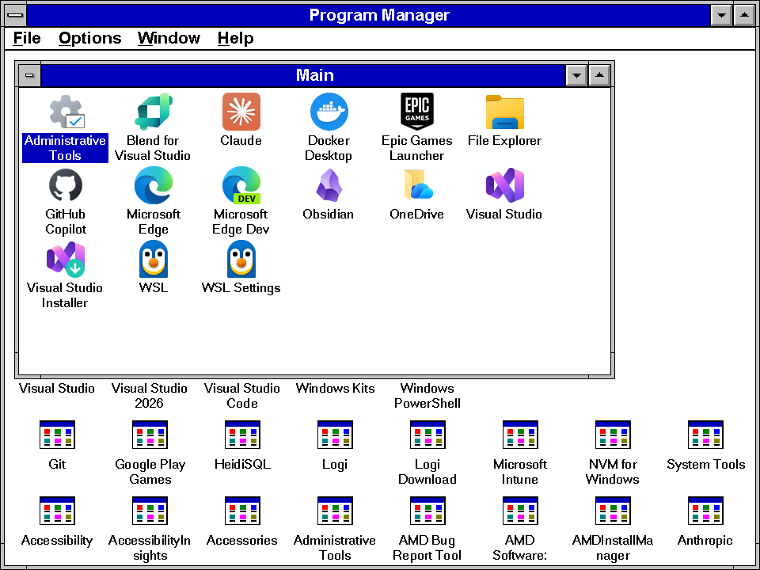
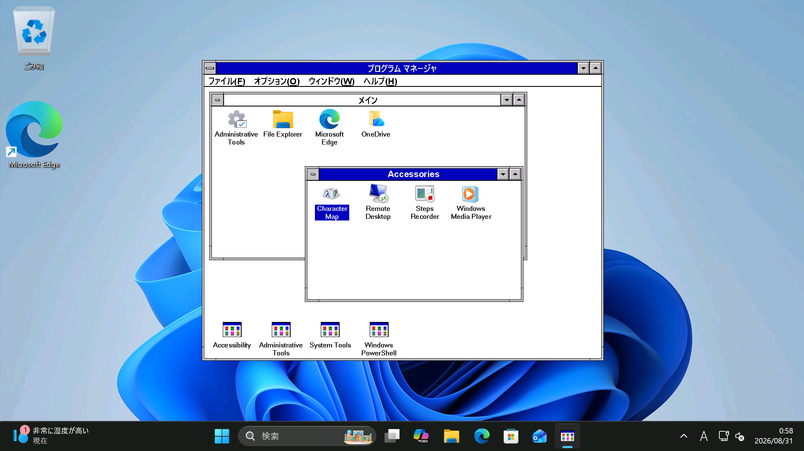
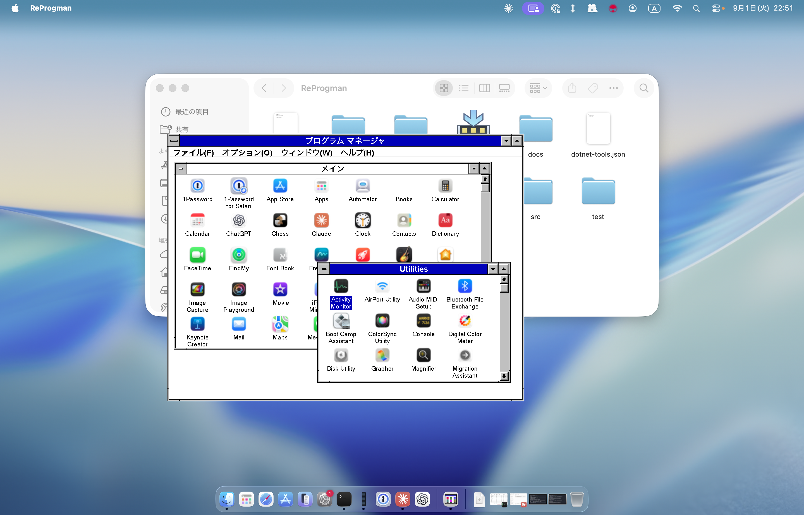

# ReProgman - Remember Progman?

A clone of the Windows 3.1 Program Manager (progman.exe), written for everyone who misses it.



The UI follows the display language of the OS — here it is on a Japanese Windows 11:



ReProgman also runs on macOS:



## Requirements
- Windows 11 (x64, Arm)
- macOS (Apple Silicon)

## Install & Run
Download the executable from Releases and run it.

The macOS build is not notarized, so its extended attributes have to be removed first:

```
xattr -cr ReProgman.app
```

## Build & Debug

Building and running needs the .NET SDK 10.0+.

```csharp
dotnet run --project src/ReProgman
```

## License

MIT License
